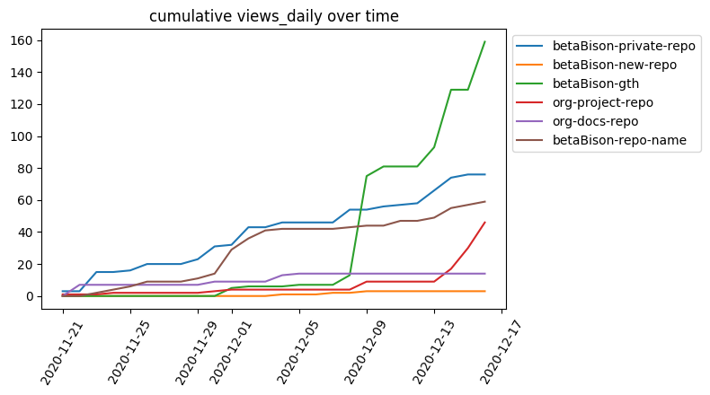

# GTH: GitHub Traffic History

This project logs traffic history data for your GitHub repositories and can optionally parse through the data to gain useful insights, plot the data, and send automatic emails with recent trends. This project was inspired by a desire to save long-term traffic history of GitHub repositories to look for patterns that extend beyond the last 14 days (all you can currently see from a respository's Insights page).

This project is broken down into several modules: requesting the traffic data, analyzing the logged traffic data, plotting the logged data, and automatically sending an email with recent history stats. These modules can be run independently. See the [Run Instructions](#run-instructions) section for more information on this project's intended modularity.



## Traffic Requester Module
This module uses the [GitHub rest API](https://developer.github.com/v3/)
through [PyGithub](https://github.com/PyGithub/PyGithub) to log traffic data for a user's owner repositories and repositories to which the user has contributed. The output of this module is a csv file with the following traffic information for each repository.

1. stars: number of stars
2. forks: number of forks
3. clones_2weeks: number of clones in the last 14 days
4. clones_uniqeus_2weeks: number of unique clones in the last 14 days
5. views_2weeks: number of views in the last 14 days
6. views_uniques_2weeks: number of views in the last 2 weeks
7. clones_daily: daily clone counts for the last 13 days
8. clones_uniques_daily: daily unique clones for the last 13 days
9. views_daily: daily view counts for the last 13 days
10. views_uniques_daily: daily unique views for the last 13 days
11. referrers_top_10: top referrers to the repository (beta)
12. content_top_10: top content in the repository (beta)

Check out the [Setting up the Traffic Requester Module](https://github.com/betaBison/gth/wiki/Setting-up-the-Traffic-Requester-Module) wiki page for more information about installing dependencies, setting up your GitHub authorization key, and stand-alone run instructions.

## Analytics Module
This module parses through the latest raw data from the traffic requester module and concatenates new data to individual repository history logs. The first output of this module is a folder `log/analytics/YYYY-MM-DD/` that contains analytics of the tracked repositories comparing the current metrics to the last time the analytics module was run. The comparative metrics the analytics module logs include:
1. began_tracking: repositories that the user has newly created or to which the user has first contributed
2. ended_tracking: repositories that have been deleted
3. stars_change: additions or deletions of stars to repositories
4. forks_change: additions or deletions of forks of repositories

The second output of this module is the `log/repos/` directory. The analytics module creates a separate folder for each repository and concatenates the metrics from the traffic requester module into individual csv files.

Check out the [Setting up the Analytics Module](https://github.com/betaBison/gth/wiki/Setting-up-the-Analytics-Module) wiki page for more information about installing dependencies and stand-alone run instructions.

## Plotter Module
This module contains plotting functions for the analytics data. The plotter has functions for plotting daily metrics or the cummulative summation of metrics over the trackd history period. The plotter has functions for graphing all repositories together (e.g. the top 10 most-viewed repositories) or graphing the metrics for a single repository by itself. Some of the plotter functions also allow you to add a date filter for only plotting historical data after a specied date. Check out the [Setting up the Plotter Module](https://github.com/betaBison/gth/wiki/Setting-up-the-Plotter-Module) wiki page for the list of dependencies and examples of the possible graph options.

## Email Sender Module
This module combines the most recently logged analytics metrics and graphs created in the plotter module into an html message. The module then uses the [Gmail API](https://developers.google.com/gmail/api/quickstart/python) to send the html message to a desired receiver. Check out the [Setting up the Email Sender Module](https://github.com/betaBison/gth/wiki/Setting-up-the-Email-Sender-Module) wiki page for more information about installing dependencies, downloading Gmail authorization credentials, and stand-alone run instructions.

## Run Instructions

This project was intended to be modular; however, the modules do have sequential dependencies on each other. The email sender module depends on metrics created by the analytics module and calls functions from the plotter module. The analytics module depends on traffic data obtained from the traffic requester module. Please go through the wiki page of each module that you would like to use to install needed dependencies or authorizations. 

The provided [main.py](https://github.com/betaBison/gth/blob/master/main.py) file shows a simple example of running all of the modules consecutively. This file can be run be executing `python3 main.py` in the project directory. You could also only run the traffic requester if you only want the raw data. You could also run the traffic requester weekly, but only run the analytics and email sender once a month. For complete traffic history coverage, the only requirement is that the traffic requester module must be run at least every 13 days (see [Disclaimer #3](#disclaimers)).

I suggest implementing a cronjob to automatically run the provided code. Check out the [Setting up a cronjob](https://github.com/betaBison/gth/wiki/Setting-up-a-cronjob) wiki page for examples of how to set up an appropraite cronjob.

If you use all modules, then you should end up with a file structure that looks similar to:
```
    ├── config/
    │   ├── credentials.json                # (opt: email_sender) Gmail credentials file
    │   ├── email_token.pickle              # (opt: email_sender) email token once you verify
    │   └── settings.ini                    # settings file
    ├── lib/
    │   ├── analytics.py                    # analytics module
    │   ├── email_sender.py                 # email sender module
    │   ├── plotter.py                      # plotter module
    │   └── traffic_requester.py            # traffic requester module
    ├── log/
    │   ├── analytics
    │       ├── YYYY-MM-DD/
    │           ├── YYYY-MM-DD.json         # comparative metrics created by the analytics module
    │           ├── plot_1.png              # (opt: email_sender) plots created with the email sender
    │           ├── plot_2.png
    │           └── ...
    │       ├── YYYY-MM-DD/
    │       ├── YYYY-MM-DD/
    │       ├── ...
    │       ├── plot_1.png                  # (opt: plotter) cummulative plots created by plotter module
    │       ├── plot_2.png
    │       └── ...
    │   ├── raw/
    │       ├── YYYY-MM-DD.csv              # raw traffic history output by the traffic requester module
    │       ├── YYYY-MM-DD.csv
    │       └── ...
    │   └── repos/                          # repository metrics separated out by the analytics module
    │       ├── your_repo_1/
    │           ├── clones_2weeks.csv
    │           ├── clones_daily.csv
    │           ├── clones_uniques_2weeks.csv
    │           ├── clones_uniques_daily.csv
    │           ├── forks.csv
    │           ├── stars.csv
    │           ├── views_2weeks.csv
    │           ├── views_daily.csv
    │           ├── views_uniques_2weeks.csv
    │           └── views_uniques_daily.csv
    │           ├── plot_1.png              # (opt: plotter) repo plots created with the plotter module
    │           ├── plot_2.png
    │           └── ...
    │       ├── your_repo_2/
    │       ├── your_repo_3/
    │       └── ...
    └── main.py                             # main example file
```

## Disclaimers
1. This project is optimized for readability and not optimized for runtime performance.
2. This project was built and tested with Python3.
3. To obtain continuous data history, run the traffic requester module at least every 13 days. Full clones and visitor information updates hourly, but referring sites and popular content sections only update daily. All traffic data uses UTC+0 timezone no matter where in the world you are [[docs](https://docs.github.com/github/visualizing-repository-data-with-graphs/viewing-traffic-to-a-repository)]. To avoid saving partial data, the traffic requester throws out the current UTC day's data, hence you're only left with 13 days worth of data instead of the expected 14.
4. If you like the idea of this project but want a nicer front end, check out [lukasz-fiszer/github-traffic-stats](https://github.com/lukasz-fiszer/github-traffic-stats).
5. If you find bugs or possible improvements, please create an issue or pull request.


